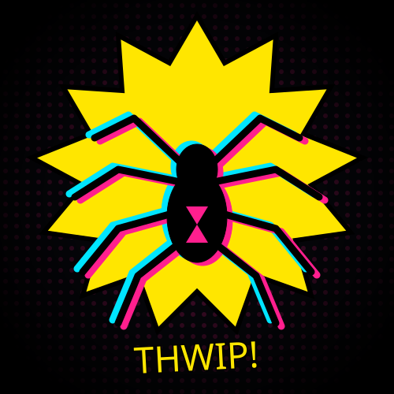

<div align="center">

<p align="center">
  
</p>

<p align="center">
  
</p>

<!-- Mau pakai gambar Spider-Man sendiri? Ganti  emblem di atas dengan:
 -->

<p align="center">
  
</p>

<p align="center"><b> Informatics Engineering Student</b></p>

</div>

---

##  `PAGE 1 — WHO AM I?`

<table>
<tr>
<td width="62%" valign="top">

> **CAPTION:** *"Yo, I'm Nidhom. Web developer. Student. Builder of weird, fun, interactive things."*

-  **Web Developer**
-  **Creative Technology Enthusiast**
-  **Game Development Explorer**
-  **Computer Vision Explorer**

</td>
<td width="38%" align="center" valign="middle">

# 💬
### `"THE CODE IS MY WEB."` 🕷️

</td>
</tr>
</table>

>  **MISSION:** *Learn something new. Build something useful. Make it memorable.*

---

##  `PAGE 2 — POWERS & GADGETS`

###  Languages — *"BAM!"*

<p>


</p>

###  Frameworks & Tech — *"POW!"*

<p>


</p>

###  Database — *"KAPOW!"*

<p>


</p>

---

## `PAGE 3 — STORIES FROM THE MULTIVERSE`

<table>
<tr>
<td width="50%" valign="top">

### ISSUE #1: GUBHUG WAYANG AR
> **"Bringing Indonesian culture into the digital world."**

Augmented Reality yang mengeksplorasi warisan budaya Indonesia lewat objek 3D interaktif.

```text
 STACK
Three.js • WebAR • GLB
JavaScript • GSAP
```

</td>
<td width="50%" valign="top">

### ISSUE #2: HAND SHADER FILTER
> **"Wave your hand. Warp reality."**

Proyek computer vision eksperimental: posisi tangan mengontrol filter visual interaktif.

```text
 STACK
Python • OpenCV
MediaPipe • Shaders
```

</td>
</tr>
</table>

### `HOW THE FILTER WORKS`

```text
CAMERA
    │  THWIP!
    ▼
 HAND DETECTION
    │  ZAP!
    ▼
 LANDMARK TRACKING
    │  SNAP!
    ▼
 FINGER POSITION
    │  BZZT!
    ▼
 SHADER EFFECT  ──►  INTERACTIVE FILTER!
```

---

## `PAGE 4 — POWER LEVELS`

```text
WEB DEVELOPMENT       ███████████████████░  90%   ← MAIN POWER 
UI / UX               ████████████████░░░░  75%
Mobile Apps           ███████████████░░░░░  70%
GAME DEVELOPMENT      ██████████████░░░░░░  65%
COMPUTER VISION       █████████████░░░░░░░  60%
```

### `TRAINING MONTAGE (CURRENTLY LEARNING)`

|  Advanced Web Dev |  AI & Computer Vision |  Game Development |
|:---:|:---:|:---:|
| ** Software Architecture** | ** UI/UX & Visual Design** | ** Interactive Web Experiences** |

---

##  `PAGE 5 — GITHUB SIGNAL`

<div align="center">


</div>

---

##  `FINAL PAGE — CONNECT`

<div align="center">

<a href="https://github.com/Nidhomcihuy">

</a>
<a href="https://linkedin.com/in/-">

</a>
<a href="mailto:-">

</a>

<br/><br/>

### 💬 *"EVERY DEVELOPER HAS A STORY. THIS IS MINE."*
### `TO BE CONTINUED...  →  NEXT ISSUE: YOUR PROJECT?`

 Thanks for visiting my profile!


</div>
